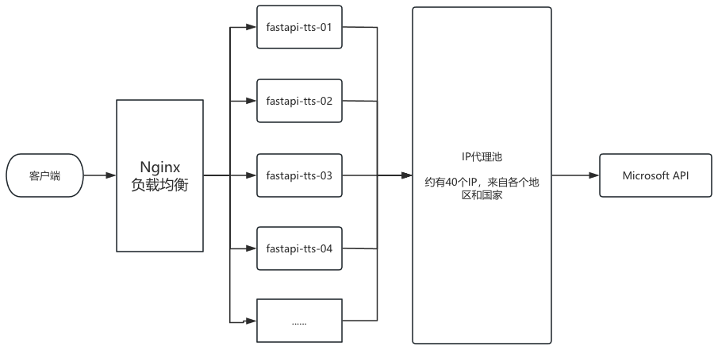

# edge-tts-fastapi
### 一个支持高并发的文本转语音服务

将edge-tts封装为了fastapi，并优化了高并发性能, 下面是系统架构示意图：

 

数据流：
- 客户端发起请求
- nginx接收请求，将请求下发到10台机器中的其中一台
- fastapi接收到请求，从代理池中获取一个IP
- fastapi向 Microsoft API 发送数据
- 数据返回到客户端